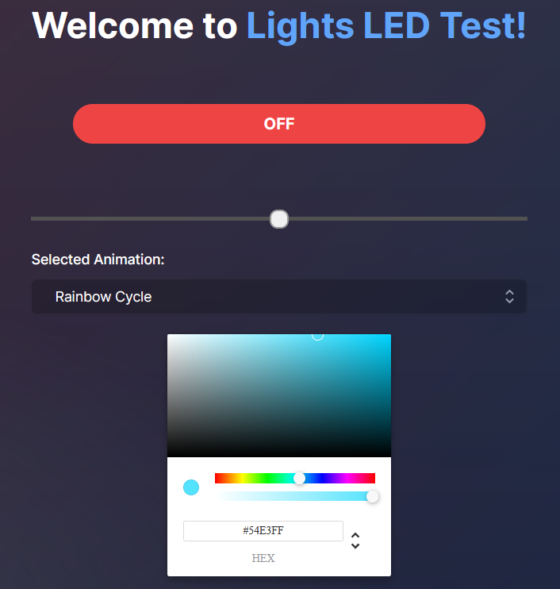

# Website Overview

## Next JS

I was looking at different ways to display the information of the LEDs to the user, as well as hosting an API. As I researched more and more, I ended up stumbling over Next JS. I ended up creating a site with it, and I hope to be using more and more of it in the future.

### Creating a Color Wheel

I'm currently using the react-color Chrome Picker component inorder to pick and choose between HSV and RGB and more.

### Headless UI / Hero Icons

Im using the Transition, and Listbox elements from Headless UI, as well as the CheckIcon and ChevronUpDownIcon to display a better looking UI for the user.

### How to use

The slider will adjust the brightness of the LEDs when the default color is selected. You can also coose the animation from the drop down to choose a preloaded animation from the list. Making a request to the api page, sends a json of all the data on the page.

